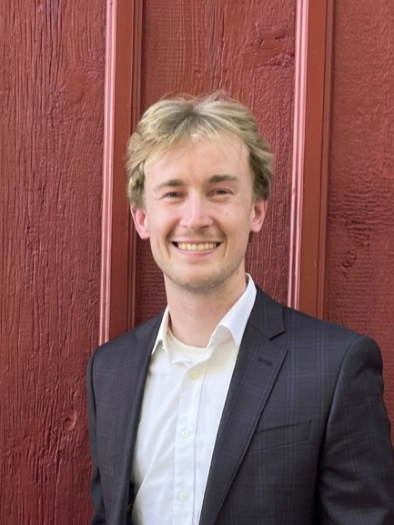

```bio-meta
{
    "name": "Noah F. Berthusen",
    "title": "Noah Berthusen",
    "description": "N. Berthusen&#8217;s curriculum vitae.",
    "url": "https://noahberthusen.github.io/",
    "assets": "https://noahberthusen.github.io/assets",
    "date-created": "2020-11-28",
    "repo": "https://github.com/noahberthusen/noahberthusen.github.io",
    "tilecolor": "#f2f2f2"
}
```

# Noah&nbsp;Berthusen

<figure class="gl-page-background gl-float-right gl-image-box" style="text-align: center;"></figure>

I am currently an Advanced Physicist at Quantinuum. I received a PhD in Computer Science from the University of Maryland in September 2025. I worked with <a href="https://www2.perimeterinstitute.ca/personal/dgottesman/">Daniel Gottesman</a> on quantum error correction.

I received a Bachelor's degree in Software Engineering from Iowa State University in May 2021.

I can be reached at <span id="_eml" class="gl-eml">someone at example dot com</span> or on <a href="https://www.linkedin.com/in/noah-berthusen-1a141a129/">LinkedIn</a>. Also visit my <a href="https://github.com/noahberthusen">Github</a> to find code repositories for many of the projects below. A full list of publications can be found on my <a href="https://scholar.google.com/citations?user=QjupysQAAAAJ&hl=en">Google Scholar</a> page.

```bio-remove
Below we use a simple mechanism to mitigate email address reaping.
Change the encoding for your own email address.
```

<!--[bio][protect]
<script type="application/javascript">
window.setTimeout(function ()
{
var addr = [
  110, 111, 97, 104, 46, 98, 101, 114, 116, 104, 117, 115, 101, 110, 64, 113, 117, 97, 110, 116, 105, 110, 117, 117, 109, 46, 99, 111, 109
];
addr = String.fromCharCode.apply(String, addr);
var eml = document.getElementById('_eml');
eml.innerHTML = '<a href="mailto:' + addr + '">' + addr + '</a>';
eml.removeAttribute('class');
}, 600);
</script>
[bio]-->


## Publications


```blog-bib

@comment
{
Use #bibitem_Venue_Key to refer to "Venue:Key".

It is possible to have multiple BibTeX blocks, which will be rendered independently. For example, you might want to have one block for each of "Publications", "Pre-prints", and "Manuscripts".

To support more information links (e.g., add "slides" or "pdf" links),
see "builder/marked.0.3.6/bibtex-service.js" line 109.
}

@misc{chain-map,
  author = {Asmae Benhemou and Noah Berthusen},
  title = {Automated logical Clifford gadgets for heterogeneous architectures via chain maps},
  biosite_url = {https://arxiv.org/abs/2607.02482}
}

@misc{concatenated,
  author = {Noah Berthusen and Elijah Durso-Sabina},
  title = {Simple logical quantum computation with concatenated symplectic double codes},
  biosite_url = {https://arxiv.org/abs/2510.18753}
}

@misc{automorphisms,
  author = {Noah Berthusen and Michael J. Gullans and Yifan Hong and Maryam Mudassar and Shi Jie Samuel Tan},
  title = {Automorphism gadgets in homological product codes},
  biosite_url = {https://arxiv.org/abs/2508.04794}
}

@misc{adaptive,
  author = {Noah Berthusen and Shi Jie Samuel Tan and Eric Huang and Daniel Gottesman},
  title = {Adaptive Syndrome Extraction},
  biosite_url = {https://arxiv.org/abs/2502.14835}
}

@misc{qccd,
  author = {Noah Berthusen and Joan Dreiling and Cameron Foltz and John P. Gaebler and Thomas M. Gatterman and Dan Gresh and Nathan Hewitt and Michael Mills and Steven A. Moses and Brian Neyenhuis and Peter Siegfried and David Hayes},
  title = {Experiments with the 4D Surface Code on a QCCD Quantum Computer},
  biosite_url = {https://arxiv.org/abs/2408.08865}
}

@misc{bivariate,
  author = {Noah Berthusen and Dhruv Devulapalli and Eddie Schoute and Andrew M. Childs and Michael J. Gullans and Alexey V. Gorshkov and Daniel Gottesman},
  title = {Toward a 2D Local Implementation of Quantum LDPC Codes},
  biosite_url = {https://arxiv.org/abs/2404.17676},
}

@misc{masked,
  author = {Noah Berthusen and Daniel Gottesman},
  title = {Partial Syndrome Measurement for Hypergraph Product Codes},
  biosite_url = {https://arxiv.org/abs/2306.17122},
  biosite_demo = {https://noahberthusen.github.io/scroller}
}

@misc{rl,
  author = {M. Sohaib Alam and Noah F. Berthusen and Peter P. Orth},
  title = {Quantum Logic Gate Synthesis as a Markov Decision Process},
  biosite_url = {https://arxiv.org/abs/1912.12002},
}

```

## Talks and Presentations


```blog-bib
@misc{
	biosite_extra = {April 2025. Invited talk for Asia Pacific QEC Seminars \n September 2025. Invited talk for HonHai (Foxconn) QC meeting},
	title = {Adaptive Syndrome Extraction},
	biosite_url = {https://www.youtube.com/watch?v=iwDiB81ZcBU}
}

@misc{tqc2024,
	biosite_extra = {September 2024. Contributed talk at TQC 2024},
	title = {Toward a 2D Local Implementation of Quantum LDPC Codes},
	biosite_url = {https://youtu.be/hBPJVG_iZLI?t=9147}
}

@misc{qec,
	biosite_extra = {October 2023. Contributed talk at QEC23},
	title = {Partial Syndrome Measurement for Hypergraph Product Codes},
	biosite_url = {https://www.youtube.com/watch?v=C2FptlwcKqI}
}

```
